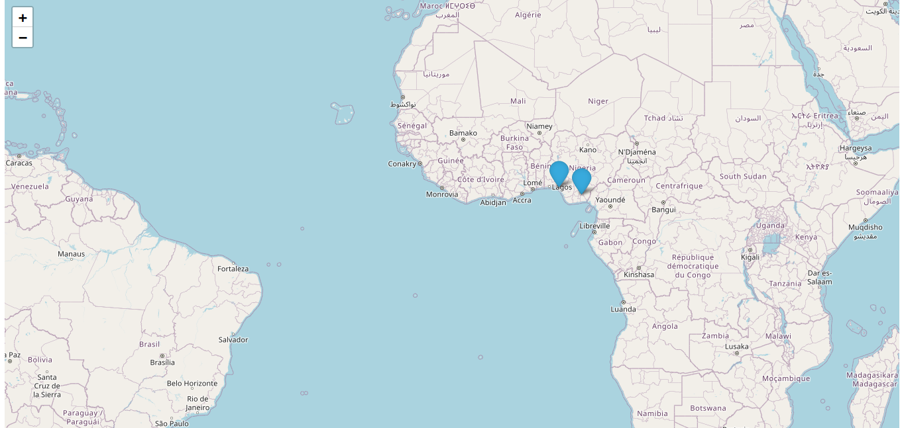

Shop Maps
=========

This is a web application to display a map with markers for shops based on their location.

Features
--------

*   Display an interactive map with shop markers using Folium
*   API to create, read, update, and delete shops in a database
*   Automated map generation showing all shops

Technologies
------------

*   Python
*   FastAPI - web framework
*   Folium - generate maps
*   Deta - serverless database

Project Structure
-----------------

`./app |-- api/ |   |-- routes.py - define API routes   | |-- models/ |   |-- shop.py - Shop data models | |-- services/ |   |-- maps.py - map generation functions | |-- database/ |   |-- crud.py - functions to access database | main.py - create FastAPI app`

Getting Started
---------------

### Prerequisites

*   Python 3.6+
*   virtualenv for virtual environments

### Installation

1.  Clone the repository

<!---->

`git clone repo`

2. Install dependencies

<!---->

`virtualenv env source env/bin/activate && pip install -r requirements.txt`

3. Create a Deta base

*   Sign up for a [Deta account](https://deta.sh)
*   Create a micro base called `shops`
*   Add Base key to `.env` file

4.  Run the API

<!---->

`uvicorn main:app --reload`

The API will be running at `http://127.0.0.1:8000`.

API Reference
-------------

The API endpoints are:

### Get all shops

`GET /shops`

### Get single shop

`GET /shops/{id}`

### Create shop

`POST /shops`

### Update shop

`PUT /shops/{id}`

### Delete shop

`DELETE /shops/{id}`

### Get map

`GET /maps`

